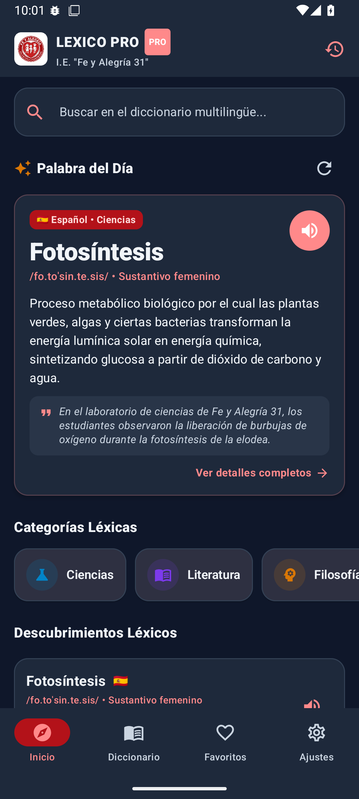
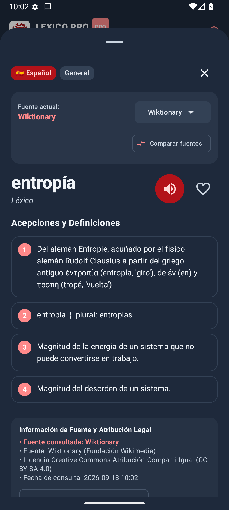
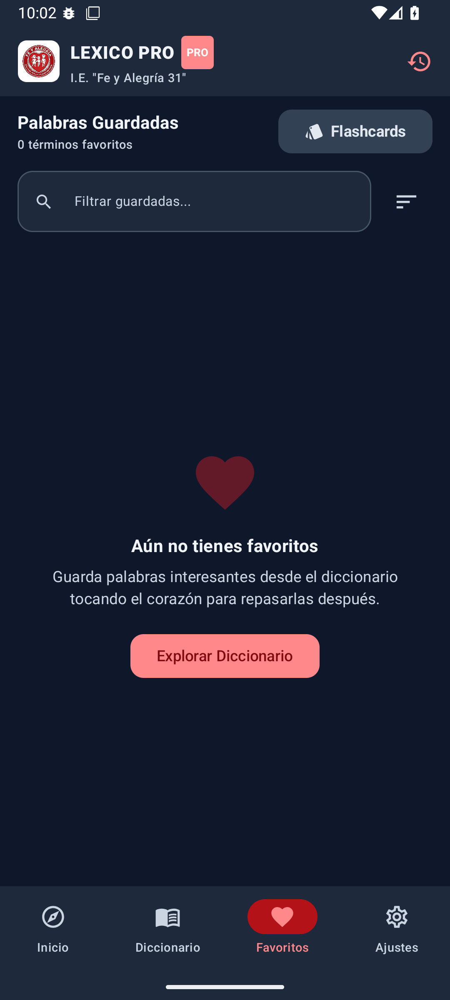
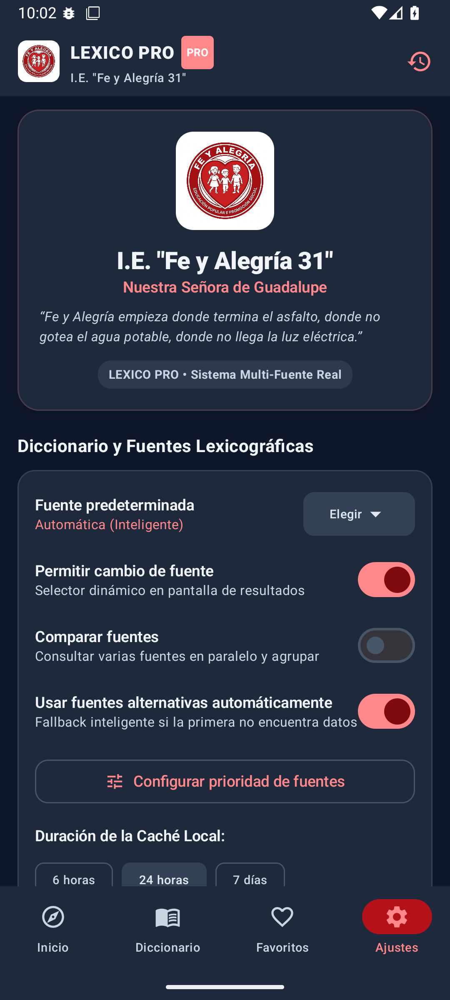

# LEXICO PRO

### Una palabra nueva. Cada vez que quieras aprender.

Lexico Pro es un diccionario multilingüe diseñado para consultar, descubrir y aprender palabras de diferentes idiomas desde una sola aplicación.

Combina las funciones tradicionales de un diccionario con herramientas modernas de búsqueda, pronunciación, traducción y aprendizaje de vocabulario.

---
## Capturas de pantalla

  
  
  

  
  

## Características principales

### Diccionario multilingüe

Consulta palabras, definiciones y traducciones en diferentes idiomas desde una misma aplicación.

### Múltiples fuentes

Lexico Pro está diseñado para consultar diferentes fuentes y servicios lexicográficos, permitiendo obtener información desde distintos proveedores.

### Selector de fuente

El usuario puede elegir qué fuente utilizar para realizar una búsqueda.

También existe un modo automático que permite utilizar diferentes fuentes disponibles cuando una fuente principal no encuentra resultados.

### Búsqueda inteligente

Busca:

- Palabras
- Traducciones
- Definiciones
- Expresiones
- Modismos
- Sinónimos
- Antónimos

También permite trabajar con variaciones como palabras sin tilde, mayúsculas, minúsculas y formas gramaticales.

### Palabra Nueva

Descubre una palabra nueva automáticamente según la frecuencia configurada.

Cada palabra puede mostrar:

- Definición
- Traducción
- Pronunciación
- IPA
- Audio
- Categoría gramatical
- Ejemplos de uso
- Sinónimos
- Antónimos
- Etimología
- Dificultad
- Fuente

El sistema también puede evitar repetir palabras vistas recientemente.

### Pronunciación y audio

Consulta la pronunciación de las palabras y escucha su audio cuando esté disponible.

### Favoritos

Guarda las palabras que quieras estudiar o consultar posteriormente.

### Historial

Accede rápidamente a tus búsquedas anteriores y vuelve a consultar cualquier palabra.

### Comparación de fuentes

Consulta información procedente de diferentes fuentes para una misma palabra y compara sus resultados.

### Personalización

Lexico Pro permite configurar diferentes aspectos de la aplicación:

- Idioma de la interfaz
- Idioma de búsqueda
- Fuente predeterminada
- Frecuencia de Palabra Nueva
- Nivel de dificultad
- Categorías
- Pronunciación
- Velocidad del audio
- Modo claro
- Modo oscuro
- Modo automático

---

## Fuentes

Lexico Pro está diseñado para trabajar con diferentes fuentes y servicios lexicográficos, entre ellos:

- Wiktionary
- Wikidata Lexicographical Data
- Wordnik
- Free Dictionary API
- RAE / DLE
- Cambridge Dictionary
- Merriam-Webster
- Collins
- Oxford Languages

La disponibilidad de cada fuente depende del idioma, API, licencia y condiciones de uso correspondientes.

---

## Tecnología

Lexico Pro utiliza tecnologías modernas para ofrecer una experiencia rápida y adaptable.

- Kotlin
- Jetpack Compose
- Material 3
- Android
- APIs y servicios lexicográficos
- Arquitectura modular de proveedores
- Caché de resultados
- Sistema de búsqueda multifuente

---

## Diseño

Lexico Pro utiliza una interfaz minimalista y orientada al aprendizaje.

### Tema claro

- Blanco como color principal
- Rojo como color primario
- Azul como color secundario
- Tonos grises para información complementaria

### Tema oscuro

- Fondos oscuros
- Texto claro
- Rojo como color primario
- Azul como color secundario

La interfaz está diseñada para mantener una buena legibilidad y adaptarse a diferentes tamaños de pantalla.

---

## Objetivo

Lexico Pro no busca ser solamente una herramienta para buscar palabras.

Su objetivo es convertir cada consulta en una oportunidad para descubrir vocabulario, comprender su significado, conocer su uso y continuar aprendiendo.

> Una palabra nueva. Cada vez que quieras aprender.

---

## Estado del proyecto

**En desarrollo**

Lexico Pro continúa evolucionando con nuevas fuentes, idiomas, funcionalidades y mejoras de rendimiento.

---

## Licencia

Este proyecto se encuentra actualmente en desarrollo.

El código, recursos y servicios de terceros utilizados por Lexico Pro están sujetos a sus respectivas licencias y condiciones de uso.
